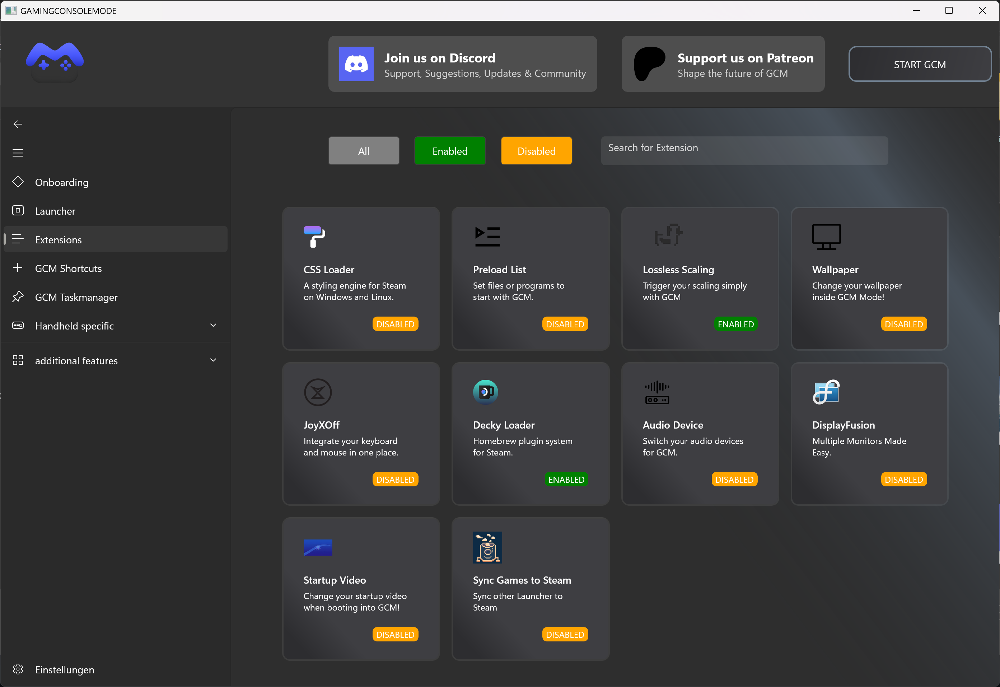
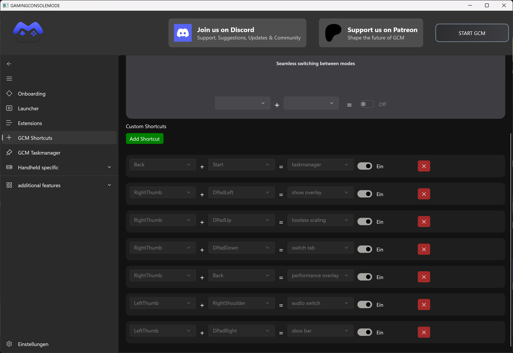

# GMC - XBOX Mode Launcher 🎮

**GameModeCompanion** (GMC Launcher) is a powerful C# application built with **WinUI 3**, designed to transform your PC into a fully functional gaming console while retaining the flexibility of the Windows operating system. GCM temporarily replaces the Windows shell with a custom gaming environment, providing a seamless console-like experience.

Whether you're a Steam enthusiast, a Playnite user, Xbox APP user, or prefer your own custom launcher, GCM offers a streamlined gaming experience without unnecessary Windows distractions.

Something like **SteamOS**, but powered by the **Windows engine**.

  

---

## ✨ Features

### 🌟 Core Functionalities

#### **1. Shell Replacement**
GCM replaces the Windows Explorer shell with its own interface, hiding the Windows desktop, taskbar, and other elements, creating a pure gaming environment.

#### **2. Support for Multiple Launchers**
- Seamlessly integrates with popular launchers like:
  - **Steam**
  - **Xbox**
  - **Playnite**
  - Custom launchers
- Automatically launches the configured game launcher on startup.

#### **3. Many Functions**
- Functions like:
  - **CSSLOADER**
  - **JOYXOFF**
  - **WALLPAPER**
  - **STARTUPVIDEO**
  - **LAUNCHER SYNC TO STEAM**
  - **DECKY LOADER FOR WINDOWS**
  - **LOSSLESS SCALING**
- and many more to come...

---

🙋‍♂️ **Found a bug or have a feature request?**  
Feel free to reach out anytime via [GitHub Issues](https://github.com/toonymak1993/GameConsoleMode/issues) or join our [Discord Server](https://discord.gg/FbjYDeEJce) to share your feedback and ideas!

---

## 🖼️ Extensions Interface

Below are screenshots of the Extensions interface for better clarity:

   
   

---

## 🚀 Usage Guide

### **1. Launching GCM**
- Run the `GCM MODE` application.
- GCM will initialize, verify required files, and configure logging.

### **2. Entering Gaming Console Mode**
- Once GCM starts, the Windows interface will be hidden.
- Your configured game launcher will launch automatically.

### **3. Immersive Gaming**
- Enjoy your games without Windows interface distractions.
- GCM handles all necessary system adjustments for a seamless experience.

### **4. Returning to Windows**
- Close your game launcher, and GCM will automatically restore the Windows desktop environment.

---

## 🤝 Contributing

GameConsoleMode is open to contributions from the community.
- To contribute:
  - Submit **issues** for bug reports or feature requests.
  - Open **pull requests** with proposed improvements or fixes.

---

## 📞 Contact

For inquiries or support, reach out via Discord: **`Lynxu`** or **`Toonymak`** or **`Toonymak`**   
Join our Discord server: [**GameConsoleMode Discord**](https://discord.gg/FbjYDeEJce)

---

GameConsoleMode continues to evolve, bringing new features and improvements with each release.  
Try it out, and let us know how we can make it even better! 🎉

